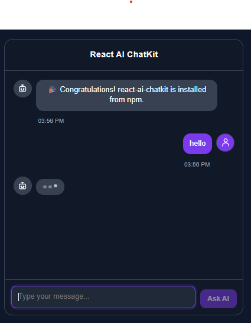

# 🤖 React AI ChatKit

> A customizable React and TypeScript chat UI component for AI assistants, SaaS applications, and chatbot interfaces.

[](https://www.npmjs.com/package/react-ai-chatkit)
[](https://www.npmjs.com/package/react-ai-chatkit)
[](LICENSE)

---

## 📸 Preview

<p align="center">
  
</p>

## ✨ Features

- 🎨 Light & Dark themes
- 🤖 AI and User avatars
- 💬 Beautiful modern chat interface
- ⌨️ Typing indicator
- 📋 Copy message button
- 📝 Markdown support
- ⏰ Message timestamps
- 🎯 Fully customizable
- 📱 Responsive design
- ⚡ Built with React + TypeScript

---

## 📦 Installation

```bash
npm install react-ai-chatkit
```

or

```bash
yarn add react-ai-chatkit
```

or

```bash
pnpm add react-ai-chatkit
```

## 🚀 Quick Start

```tsx
import { AIChatBox } from "react-ai-chatkit";
import type { Message } from "react-ai-chatkit";

const messages: Message[] = [
  {
    id: "1",
    text: "Hello! How can I help you?",
    sender: "ai",
  },
];

<AIChatBox
  messages={messages}
  onSendMessage={(message) => console.log(message)}
/>;
```
## 💡 Why React AI ChatKit?

React AI ChatKit helps you build modern AI chat interfaces without spending hours creating common chat features from scratch.

It comes with:

- Modern UI
- Markdown rendering
- Typing indicator
- Copy message button
- AI & User avatars
- Responsive layout
- TypeScript support
- Customizable appearance

Perfect for:

- AI SaaS products
- Customer support bots
- Internal AI tools
- LLM interfaces
- ChatGPT-like applications
