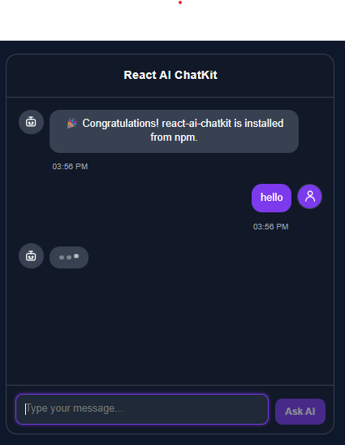

# 🤖 React AI ChatKit

> A customizable React + TypeScript chat component for AI assistants, SaaS applications, internal tools, and chatbot interfaces.

[](https://www.npmjs.com/package/react-ai-chatkit)
[](https://www.npmjs.com/package/react-ai-chatkit)
[](LICENSE)
[](https://github.com/mdqasim786/react-ai-chatkit)

---

## 📸 Preview

<p align="center">
  
</p>

---

## ✨ Features

- 🎨 Light & Dark themes with a consistent internal color system
- 🎨 Custom primary color
- 🤖 AI & User avatars (image or custom fallback)
- 🎛️ Fully customizable header, empty state, input, and send button
- 💬 Modern chat interface
- 📝 Markdown rendering (headings, lists, links, blockquotes, inline code, tables)
- 📄 Syntax highlighted code blocks with copy button
- 📋 Copy message button with accessible feedback
- ⌨️ Enter to send, Shift + Enter for new lines
- ⌨️ Animated typing indicator and send-button loading state
- ⏰ Message timestamps with optional formatter
- 📱 Responsive design with no horizontal overflow
- ⚡ TypeScript support with exported types

---

# 📦 Installation

```bash
npm install react-ai-chatkit
```

or

```bash
yarn add react-ai-chatkit
```

or

```bash
pnpm add react-ai-chatkit
```

---

# 🚀 Quick Start

```tsx
import { AIChatBox } from "react-ai-chatkit";
import type { Message } from "react-ai-chatkit";

const messages: Message[] = [
  {
    id: "1",
    text: "Hello! How can I help you?",
    sender: "ai",
  },
];

export default function App() {
  return (
    <AIChatBox
      messages={messages}
      onSendMessage={(message) => console.log(message)}
    />
  );
}
```

---

# 🎨 Customization

```tsx
import { AIChatBox } from "react-ai-chatkit";
import type { Message } from "react-ai-chatkit";

const messages: Message[] = [
  {
    id: "1",
    text: "Hello! How can I help you?",
    sender: "ai",
    timestamp: "10:00",
  },
];

export default function App() {
  return (
    <AIChatBox
      messages={messages}
      onSendMessage={(message) => console.log(message)}
      title="AI Assistant"
      subtitle="Online"
      theme="light"
      primaryColor="#6366f1"
      width="500px"
      height="600px"
      aiAvatarFallback={<span>🤖</span>}
      userAvatarFallback={<span>🙂</span>}
      emptyStateTitle="How can I help?"
      emptyStateDescription="Ask me anything."
      placeholder="Type your message..."
      maxInputLength={500}
      sendButtonText="Send"
      timestampFormatter={(timestamp) => `at ${timestamp}`}
    />
  );
}
```

### Custom header, send button, and message styles

```tsx
<AIChatBox
  messages={messages}
  onSendMessage={handleSend}
  header={
    <div style={{ display: "flex", alignItems: "center", gap: 8 }}>
      <strong>Support</strong>
    </div>
  }
  headerActions={<button type="button">Settings</button>}
  sendButtonContent={
    <svg width="16" height="16" viewBox="0 0 24 24" fill="none" stroke="currentColor">
      <path d="m5 12 4 4L19 6" />
    </svg>
  }
  userMessageStyle={{ marginTop: 4 }}
  aiMessageClassName="ai-message-box"
/>
```

### Typing / sending state

```tsx
<AIChatBox
  messages={messages}
  onSendMessage={handleSend}
  isTyping={isWaiting}
  isSending={isWaiting} // disables the send button and shows a spinner
/>
```

---

# ⚙️ Props

| Prop | Type | Default | Description |
|------|------|---------|-------------|
| messages | `Message[]` | Required | Chat messages |
| onSendMessage | `(message: string) => void` | `undefined` | Called when a message is sent |
| title | `string` | `"React AI Chatbox"` | Header title |
| subtitle | `string` | `undefined` | Optional header subtitle |
| header | `ReactNode` | `undefined` | Replaces the default header content |
| headerActions | `ReactNode` | `undefined` | Action content shown on the right side of the header |
| theme | `"light"` \| `"dark"` | `"dark"` | Theme |
| primaryColor | `string` | `#7c3aed` | Primary accent color |
| width | `string` \| `number` | `"450px"` | Component width |
| height | `string` \| `number` | `"520px"` | Component height |
| placeholder | `string` | `"Type your message..."` | Input placeholder |
| disabled | `boolean` | `false` | Disable input |
| isTyping | `boolean` | `false` | Show typing indicator |
| isSending | `boolean` | `false` | Disable send and show a spinner while sending |
| showHeader | `boolean` | `true` | Show header |
| showAvatars | `boolean` | `true` | Show avatars |
| aiAvatar | `string` | `undefined` | AI avatar image URL |
| userAvatar | `string` | `undefined` | User avatar image URL |
| aiAvatarFallback | `ReactNode` | Robot icon | Content shown when no AI avatar image is set |
| userAvatarFallback | `ReactNode` | Person icon | Content shown when no user avatar image is set |
| aiMessageClassName | `string` | `undefined` | Class added to AI message rows |
| aiMessageStyle | `React.CSSProperties` | `undefined` | Style added to AI message rows |
| userMessageClassName | `string` | `undefined` | Class added to user message rows |
| userMessageStyle | `React.CSSProperties` | `undefined` | Style added to user message rows |
| showCopyButton | `boolean` | `true` | Show the message copy button |
| showSendButton | `boolean` | `true` | Show the send button |
| sendButtonText | `string` | `"Ask AI"` | Send button text (and accessible label for custom content) |
| sendButtonContent | `ReactNode` | `undefined` | Custom send button content/icon |
| showTimestamps | `boolean` | `true` | Show timestamps |
| timestampFormatter | `(timestamp: string) => string` | `undefined` | Format the rendered timestamp |
| emptyStateTitle | `string` | `"Start a conversation"` | Empty state title |
| emptyStateDescription | `string` | `"Send a message to begin chatting."` | Empty state description |
| emptyStateContent | `ReactNode` | `undefined` | Replaces the default empty state content |
| inputProps | `TextareaHTMLAttributes<HTMLTextAreaElement>` | `undefined` | Native textarea props |
| inputClassName | `string` | `undefined` | Class added to the textarea |
| inputStyle | `React.CSSProperties` | `undefined` | Style added to the textarea |
| inputContainerClassName | `string` | `undefined` | Class added to the input container (footer) |
| inputContainerStyle | `React.CSSProperties` | `undefined` | Style added to the input container (footer) |
| maxInputLength | `number` | `undefined` | Maximum input length |
| className | `string` | `undefined` | Class added to the component root |
| style | `React.CSSProperties` | `undefined` | Style added to the component root |

### Message type

```ts
interface Message {
  id: string;
  text: string;
  sender: "user" | "ai";
  timestamp?: string;
}
```

### Theme colors

The internal color system is exported for custom styles:

```tsx
import { getChatColors } from "react-ai-chatkit";

const colors = getChatColors("dark");
// { background, text, border, aiBubble, inputBackground, mutedText, success }
```

---

# 📄 Markdown Example

````tsx
const aiMessage = {
  sender: "ai",
  text: `
# Welcome

Here is some code:

\`\`\`tsx
function Button() {
  return <button>Hello</button>;
}
\`\`\`
`,
};
````

Markdown with tables, lists, quotes, and links is supported out of the box.

---

# 📚 TypeScript Usage

```tsx
import { AIChatBox } from "react-ai-chatkit";
import type {
  AIChatBoxProps,
  ChatColors,
  ChatTheme,
  Message,
} from "react-ai-chatkit";

const config: AIChatBoxProps = {
  messages: [],
  onSendMessage: (message: string) => console.log(message),
  theme: "dark",
};

export default function App() {
  return <AIChatBox {...config} />;
}
```

---

# 🔗 Links

- 📖 [GitHub](https://github.com/mdqasim786/react-ai-chatkit)
- 📦 [npm](https://www.npmjs.com/package/react-ai-chatkit)
- 🐛 [Report an issue](https://github.com/mdqasim786/react-ai-chatkit/issues)

---

# 📄 License

MIT